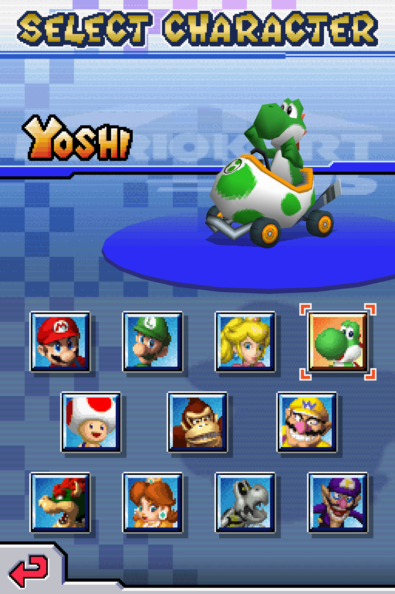

<h1 align="center"><b>melonDS X432R+</b></h1>

melonDS X432R+ is an experimental fork of
[melonDS](https://github.com/melonDS-emu/melonDS).
It is like the old DeSmuME X432R fork, but for users that want to 
upscale 2D graphics and 3D textures.

This is not the official melonDS release. If you want a stable emulator, 
use the official melonDS builds.

Nintendo DS games use many different graphics tricks, so some enhancements 
can cause visual problems. In most games, though, you can turn on at least 
some of the features and things will look noticeably better.

## Main Additions

- Anisotropic filtering.
- 3D texture scaling using the GPU (Spline36, xBRZ, ArtCNN, ArtCNN DN, 
  NNEDI3, and CuNNy).
- Whole-scene 2D scaling modes for UI, sprites, title screens, text, menus, and
  mixed 2D/3D scenes.
- `Hybrid Upscale`, the main 2D scaling mode, which tries to combine sharp 3D
  with cleaner scaled 2D. When different things make scaling unsafe, it falls
  back to the low-res image for those pixels.
- `Postprocessing Upscale`, the other major mode, which scales the 2D and 3D
  together as one image. This is less likely to have weird scaling issues than
  the Hybrid mode, but the 3D usually looks softer.
- A widescreen option.
- `3D anti-aliasing` for Classic OpenGL and Compute.
- A screen sharpening filter for blurry output.
- Debug tools for whole-scene 2D, texture-scaling inspection, timings, 
  replays, and renderer comparison.
- Renderer and FMV fixes.

Most of the enhancements in this fork are GPU-based and require the Classic
OpenGL or Compute renderer.

## How It Looks

  <b>Mario Kart</b> 
  4x internal resolution (Compute Renderer), with and without
  X432R+ enhancements 
  Hybrid Upscale + 16x Anisotropic Filtering + Texture Scaling, using NNEDI3 
  

## Getting Started

1. Open Config -> Video settings.
2. Use `OpenGL (Compute shader)`, or `OpenGL (Classic)` on macOS.
3. Click `Recommended settings`.
4. Try other upscaling algorithms and adjust `Internal resolution` to suit
   your game and GPU.

The recommended settings use Hybrid Upscale at 4x resolution with Spline36.
They are a starting point. Performance depends on the game and your hardware.
They set up the advanced options too, so you don't need to go through all of
those yourself.

Texture upscaling is left off because it can cause slowdowns, but it is worth
trying. The example above has it on and uses NNEDI3. Try a few algorithms and
see what you like. It really depends on the game. If things run too slowly,
see the suggestions under **If things run slowly** below.

Your widescreen layout, sharpening, and LCD ghosting are left as you set them.
Your renderer is also kept, except that Recommended settings selects Classic
when Compute isn't supported. If you don't like the changes, click `Cancel`
before closing the dialog.

The Compute renderer requires a GPU that supports OpenGL 4.3. The native macOS
build uses Classic OpenGL and cannot use the ArtCNN, ArtCNN DN, NNEDI3, or CuNNy
algorithms, which require compute shaders. Spline36 and xBRZ are available.

The video settings dialog also has helpful tooltips. Click the `?` button
in the dialog, then click a setting to see what it does.

## Settings

The recommended settings are a starting point. From there, try changing one
thing at a time so you can see what difference it makes.

### Screen upscaling

`Hybrid Upscale` keeps high-resolution 3D while improving the 2D artwork around
it. It works well in many games, but some effects are difficult to handle.
Parts of the image may stay at their original detail when scaling them would
look worse.

If Hybrid looks wrong, try `Postprocessing Upscale`. It scales the 2D and 3D
together as one image, which avoids some of those problems, but usually makes
the 3D look softer. It can work particularly well in games that use 3D textures
to draw 2D artwork, such as Final Fantasy Tactics A2 or Professor Layton.

If 2D and 3D edges don't line up properly in Postprocessing, try
`Render 3D at native resolution`. Normally, Postprocessing renders the 3D at
high resolution and then reduces it before upscaling everything together.
This option renders the 3D at the original DS resolution instead. You lose
some 3D detail, but certain games look better this way.

### Texture filtering and upscaling

`Anisotropic filtering` helps reduce shimmer on slanted or distant textured
surfaces. It is usually less demanding than texture upscaling.

`Upscale textures`, on the `3D textures` tab, is worth trying when textures
are right up in your face. It can make them look much better, but it can also
cause stutter.

Both options can leave thin lines or stray pixels around texture edges,
particularly on UI and sprites. Try `Reduce 2D texture artifacts` if this
happens. It can cost performance and won't fix every game, so sometimes turning
filtering or texture upscaling off is the better choice.

If transparent edges look blocky with texture upscaling on, try
`Cleaner transparent edges`.

### Choosing an algorithm

Texture and screen upscaling have separate algorithm choices. You can use the
same one for both, or mix them. Try a few and see what suits the game's artwork.

Algorithm-wise, none of them are perfect. 
`Spline36` is usually a low-cost option. It smooths pixel edges but leaves the
underlying blockiness visible. 
`xBRZ` rounds off pixel-art shapes. It can look clean and crisp, but small
details may become smudged or distorted. 
`ArtCNN` gives a sharp, detailed look, but can make noisy textures and rough
edges stand out. 
`ArtCNN DN` gives a smoother, cleaner look, sometimes at the expense of fine
detail. 
`NNEDI3` smooths edges and diagonals with less reshaping than xBRZ. It can look
soft, especially around small text. 
`CuNNy` gives a crisp look with more visible pixel structure than ArtCNN in
some scenes. Text and fine details can look cleaner or rougher depending on
the artwork. 

### If things run slowly

Try lowering `Internal resolution` first. Spline36 is often a good choice for
performance, but try xBRZ too. It can be faster on some hardware and in some
scenes, including with Hybrid.

If Hybrid is still too slow, enable `Advanced settings` and try
`Native Stack Upscale` or `Presentation Overlay Upscale` on the `2D & screen`
tab. Both keep high-resolution 3D but use simpler approaches to scaling and
combining the 2D graphics.

They can be faster, but parts of the picture may look wrong, even in simple
scenes. Try both to see whether either works well with your game. Hybrid
handles more of these cases correctly, which is why it is recommended.

If texture upscaling causes stutter, try `Limit upscaling of changing textures`
or `Defer texture upscaling`. The first uses simpler scaling for rapidly
changing textures. The second leaves some new textures at their original
detail until they are reused and stable enough to upscale.

For slowdowns caused by screen upscaling, you can also enable
`Advanced settings` and adjust `Slowdown fallback` on the `2D & screen` tab.

### Anti-aliasing and final image settings

`3D anti-aliasing` smooths jagged 3D edges. Classic OpenGL uses MSAA. Compute
forces the DS anti-aliasing effect on. When unchecked, it follows the game's
setting. If the game already enables it, checking this makes no additional
difference in Compute.

It is worth trying, including with Postprocessing, but it can cause stray
dark or bright lines in some games. Classic and Compute can also look
different, so try the other renderer if something looks wrong.

If the image looks too blurry, choose a `Screen sharpening` level under
`Final image` on the `General` tab.

In the same section, `LCD ghosting` blends frames to mimic how the original
DS screen softens changes from one image to the next. It helps with flickering
effects in games such as Hotel Dusk, though `Natural blur` can also leave trails
when things move.

## Known Limits

- Hybrid Upscale is conservative on purpose. Native-looking output may be a
  fallback just because the alternative looks far worse. It is not automatically
  a bug.
- Edge cases involving blending, screen masks, display capture, and brightness
  effects are all things that can cause the 2D scaling to fall back.
- Text may look darker after scaling with most algorithms except xBRZ.
- 3D texture scaling is optional and performance-sensitive.
  `Defer texture upscaling` and `Limit upscaling of changing textures` help,
  but you may still get hitches.
- Anisotropic filtering and texture scaling can leave thin lines, stray pixels,
  or weird-looking UI around texture edges. `Reduce 2D texture artifacts` helps
  in some games, but you may need to turn filtering or texture scaling off.
- Widescreen is still experimental. It can reveal missing scenery or things
  the game wasn't meant to show, and the extra screen area can look wrong or
  flicker during fades and transitions. Menus, logos, and borders may stay at
  their original size instead of filling the wider screen.
- `3D anti-aliasing` will sometimes cause sporadic black or bright lines to
  appear.

## BIOS, Firmware, And Games

You need your own legally obtained game dumps. Firmware boot, as opposed to
direct boot, requires BIOS and firmware dumps from an original DS or DS Lite.

Possible firmware sizes:

- 128 KB: DSi/3DS DS-mode firmware, reduced because it lacks bootcode.
- 256 KB: regular DS firmware.
- 512 KB: iQue DS firmware.

DS BIOS dumps from a DSi or 3DS can be used for DS-mode compatibility. DSi-mode
BIOS dumps are not the same thing.

## Building

See [BUILD.md](./BUILD.md) for build instructions on Linux, Windows, macOS, and
Nix. X432R+ does not require a separate build system.

## Relationship To melonDS

This fork depends on upstream melonDS and keeps its licensing and much of its
project structure. X432R+ changes are renderer-focused.

Please do not report X432R+-specific enhancement bugs to upstream melonDS
unless you can reproduce the same problem in an official upstream build with the
enhancement features disabled.

## Credits

Scaler algorithms used by this fork:

- Artoriuz for the ArtCNN models: https://github.com/Artoriuz/ArtCNN
- funnyplanter for CuNNy: https://github.com/funnyplanter/CuNNy
- tritical for NNEDI3, and bjin for the mpv NNEDI3 prescaler shaders:
  https://github.com/bjin/mpv-prescalers
- Zenju for xBRZ, with Hyllian's xBR shader code and hunterk's RetroArch
  xbrz-freescale port: https://github.com/libretro/glsl-shaders

Upstream melonDS credits:

- Martin for GBAtek.
- Cydrak for extra 3D GPU research.
- limittox for the icon.
- The melonDS community for testing, issue reports, and suggestions.

## License

melonDS and this fork are free software: you can redistribute them and/or modify
them under the terms of the GNU General Public License as published by the Free
Software Foundation, either version 3 of the License, or at your option any
later version.

External assets:

- Images used in the input config dialog: see
  [src/frontend/qt_sdl/InputConfig/resources/LICENSE.md](./src/frontend/qt_sdl/InputConfig/resources/LICENSE.md).
- The CuNNy compute shaders keep funnyplanter's upstream license notices: see
  [src/OpenGL_shaders](./src/OpenGL_shaders).
- The NNEDI3 compute shaders are based on the LGPL mpv prescaler shaders,
  and the original NNEDI3 algorithm and weights are tritical's (GPL).
